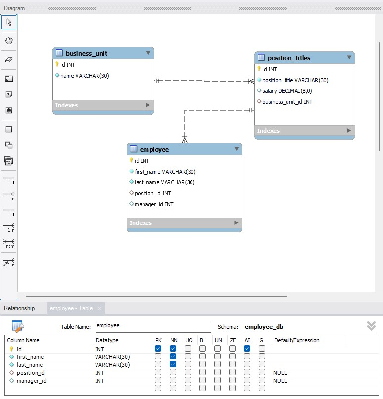
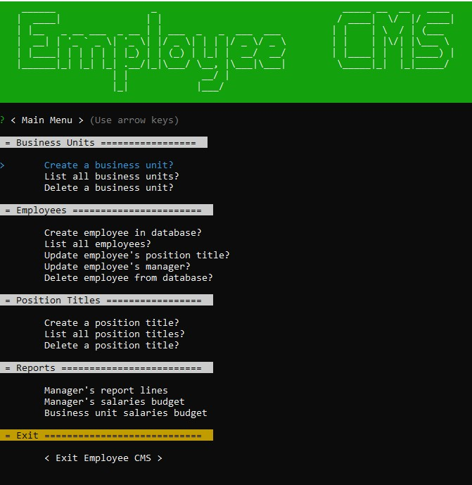
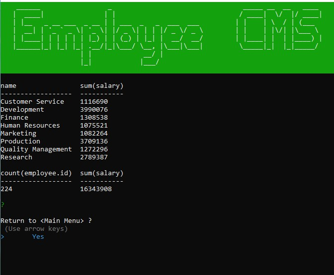
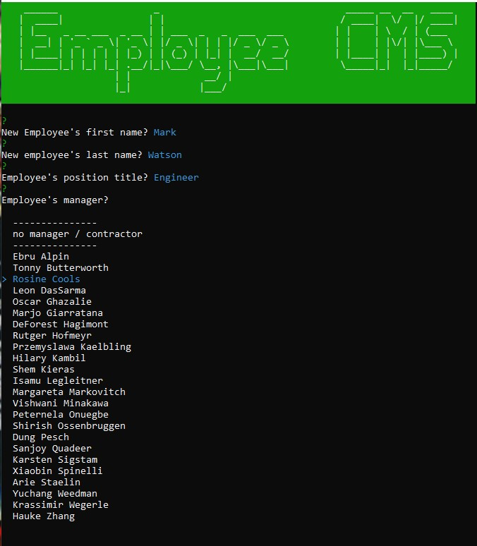

# USYD-FSF Week12 Project
## SQL: Employee Tracker

### Table of Contents  
  
   1. [Project Description](#1-description)
   2. [Application Features](#2-features)
   3. [Installation](#3-installation)
   4. [Usage](#4-usage)
   5. [Credits](#5-credits)
   6. [License](#6-license)
   7. [Repository Status](#7-github-repo-status)
   8. [Contribute](#8-how-to-contribute)
   9. [Tests](#9-tests)
   10. [Checklist](#10-checklist)

---
### 1. Description  
**What is this project?**  
* A Node.js command-line application for managing a company’s employee database.  In addition to Node.js, other technologies used are Inquirer and MySQL

**Why this project?**  
* Developers are often asked to create interfaces that allow users to easily view and interact with information stored in databases. The interfaces are termed content management systems (CMS). This assignment is demonstrating some ideas for a content management system.

  


**What problem does this project solve?**  
* Provides a user friendly interface for people to quickly access and manage data to improve the management process.

**Lessons learnt?**  
* First preparing pseudo code or a flow diagram before doing any of the coding was essential for this assignment due to the different pathways needing coding.
* Whilst I did the coding I found this project a huge task to achieve a minimum viable product (MVP) in less than 1 week.  Main reason was the need to familiarise myself more deeply than what was covered in class with mySQL queries.  My code, unfortunately, shows the progression of my knowledge in handling the mySQL queries.  There is a lot of room to go back and tidy all of the code up.
* I lost a lot of time with inquirer, getting the async to work well for populating the list choices.  
* I created a seeds.sql file with over 200 employees.  I grabbed the data from mySQL's sample employee database.  I ended up having to rework a lot of the data and it cost me a lot of time as this assignment is a significantly simpler database than the mySQL example.  For example, I ended up simplifying the salaries to be more 'grouped' as mySQL's data had all unique salaries.
* Whilst I've set the app up with over 200 employees, I realise the limitations of the command line environment would suggest that this application and similar Node.js apps would be better suited for companies with less than 50 employees.
* I also, last minute, decided to change the table names and column names to align with Australian terminology, for example instead of Role, I changed to Position and Department to Business Unit.  Unfortunately I made the call to change this after I'd already set up the code base - something I should of decided on from the beginning.
* I did my best code with modules but as I was trying to work fast I decided to focus more on getting a function application and then if time permits going back to tidy up the code, time has not permitted.
* When an application becomes large with different menu options it becomes problematic testing the application for errors as just getting to each menu can be time consuming.  I can see the benefits of setting Jest unit testing up to help with this.  Unfortunately I ran out of time to prepare any unit tests.

---
### 2. Features  
Client requested features as implemented:  
   - a command-line application that accepts user input
   - on starting the application, the user is presented with the option to: view all departments, view all roles, view all employees, add a department, add a role, add an employee, and update an employee role
   - Choosing to view all departments will present the user with a formatted table showing department names and department ids.
   - Choosing to view all roles presents the user with job title, role id, the department that role belongs to, and the salary for that role
   - Choosing to view all employees presents the user with a formatted table showing employee data, including employee ids, first names, last names, job titles, departments, salaries, and managers that the employees report to
   - Choosing to add a department prompts the user to enter the name of the department and that department is added to the database.
   - Choosing to add a role prompts the user to enter the name, salary, and department for the role and that role is added to the database.
   - Choosing to add an employee prompts the user to enter the employee’s first name, last name, role, and manager, and that employee is added to the database
   - Choosing to update an employee role prompts the user to select an employee to update and their new role and this information is updated in the database.

   A walkthrough video has been prepared to demonstrate the features of the application.  The video is approximately 120Mb so it might be slow to start playing from my Google Drive if you don't download it first.  [Link to the video](https://drive.google.com/file/d/1TnSf_zIK8_5QUskd96Fgak2P1SoN5xHX/view?usp=sharing)

---
### 3. Installation  
You can download the source code from [my Github repository](https://github.com/Mark33Mark/employee-cms) and unzip the files to a location on your computer.  Once saved you will need to initialise the application and install dependencies by typing from a command line located in the directory where you saved the files:

```
npm init -y
npm install
```
Once the node.js dependencies are installed, you need to upload the database and the seed data.  Log into your my SQL and run the following commands:

```
> mysql -u YOUR USER NAME OR ROOT -p
(you will then be prompted for your password )
   source db/schema.sql
   source db/seeds.sql
   quit
```
Once all dependencies are installed and you have created the employee_db database and seeded it with the data, you will need to amend the .env.EXAMPLE file by renaming it .env and updating the contents of the file with your mySQL username, database name and mySQL password.  

Once all of these actions are completed you can run the application by typing:

```
node index.js
```
---

### 4. Usage  
The code can be downloaded from [my Github repository](https://github.com/Mark33Mark/employee-cms) for all assets created for the project.  
You can modify the code as you need.

---
### 5. Credits  
I referenced a lot of online material.  There are no particular call outs. I referenced some of my own code from past assignments.

---
### 6. License  
 The works in this repository are subject to:  

[](doc/LICENSE.md)

---
### 7. Github repo status  


---
### 8. How to Contribute
 If you would like to contribute, please comply with the Contributor Covenant Code of Conduct:  

[](doc/code_of_conduct.md)

---
### 9. Tests  
- No unit tests have been prepared for this project.  Testing done on my desktop running different scenarios.  A problem exists causing the application to glitch when trying to change an employee after deleting their manager.  Needs to be resolved.

---
### 10. Checklist  
 All actions not checked are still to be completed:

 [x]  GitHub repository containing your application code.  
 [x]  Walkthrough video demonstrating the functionality of the employee tracker must be submitted [Walkthrough link on Google Drive](https://drive.google.com/file/d/1TnSf_zIK8_5QUskd96Fgak2P1SoN5xHX/view?usp=sharing)  
 [x]  Walkthrough video shows all of the technical acceptance criteria being met.  
 [x]  Walkthrough video demonstrates to invoke the application from the command line.  
 [x]  Walkthrough video demonstrates a functional menu with the options outlined in the acceptance criteria.  
 [x]  The application uses the Inquirer package, mySQL2 and console.table.
 [x]  The database folls the table schema provided in the homework instructions.  
 [x]  Application allows users to update employee managers.
 [x]  Application allows users to view employees by manager.
 [x]  Application allows users to view employees by department.
 [x]  Application allows users to delete departments, roles, and employees.
 [x]  Application allows users to view the total utilized budget of a department—in other words, the combined salaries of all employees in that department.
 [x]  The GitHub repository contains all the application code.
 [x]  Application console is free of errors.  
 [x]  Repository has a unique name; follows best practice for file structure; and naming conventions.  
 [x]  The application resembles the mock-up functionality provided in the assigment instructions.  
 [x]  Repsository follows best practices for class/id naming conventions, indentation, quality comments, etc.  
 [x]  Repository contains multiple descriptive commit messages.  
 [x]  Repository contains a README file with descriptio, screenshot and link to deployed application.  

---

- [Back to the top](#usyd-fsf-week12-project)